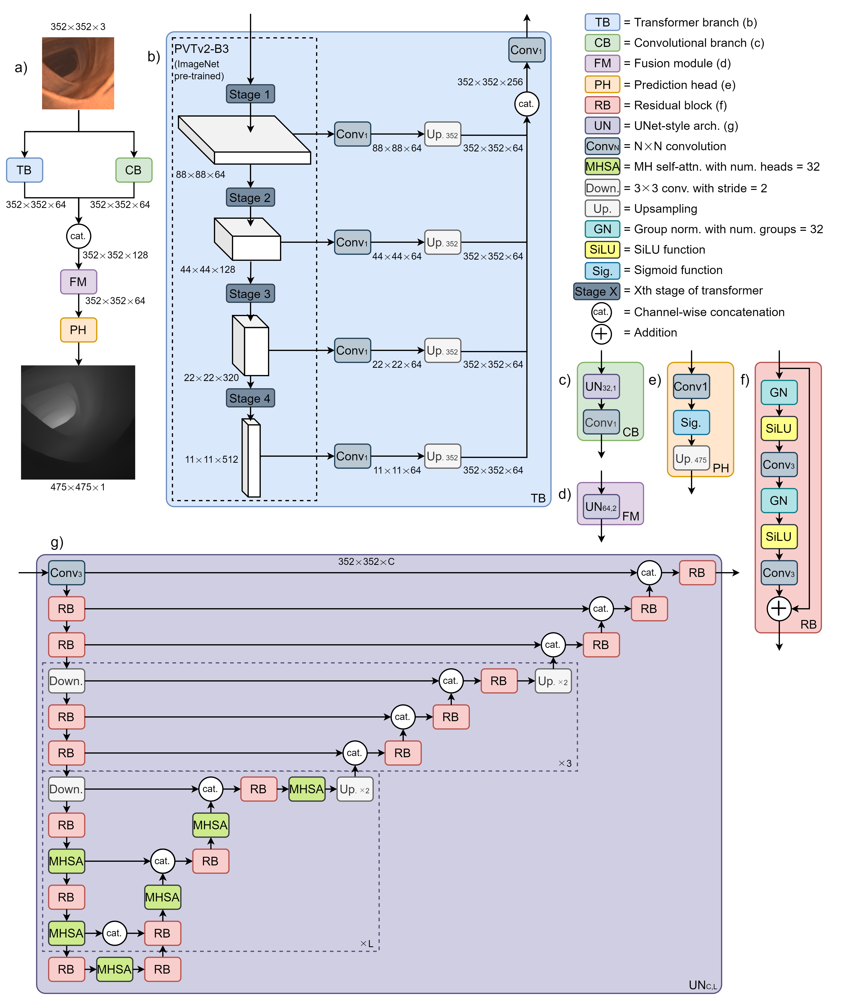
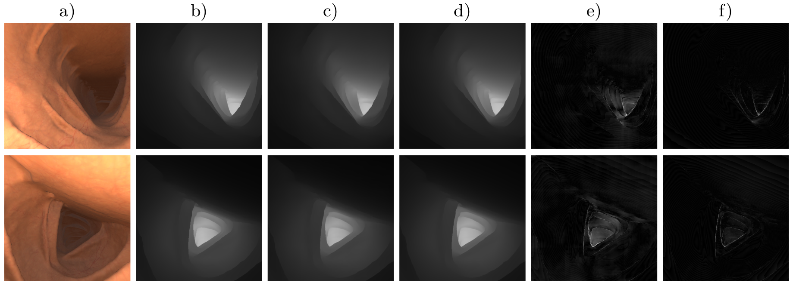

# SimCol-Entry
Code repository for Team CVML's winning entry (FCBFormer-D) to the depth estimation task in the [SimCol3D 2022 challenge](https://www.ucl.ac.uk/interventional-surgical-sciences/simcol3d-3d-reconstruction-during-colonoscopy-challenge), hosted by the EndoVis Challenge at MICCAI 2022.

Team CVML: [Edward Sanderson](https://scholar.google.com/citations?user=ea4c7r0AAAAJ&hl=en&oi=ao) and [Bogdan J. Matuszewski](https://scholar.google.co.uk/citations?user=QlUO_oAAAAAJ&hl=en)

Links to the challenge paper:
+ [arXiv](https://arxiv.org/abs/2307.11261)


## 1. Overview

### 1.1 Background

Colorectal cancer (CRC) is one of the leading causes of cancer mortality worldwide. In order to diagnose CRC early and prevent its development, a patients colon can be screened for polyps, and potentially treated, through a colonoscopy procedure. Computer vision offers opportunities to improve on current practices in colonoscopy, by automatically processing the images captured during colonoscopy to support clinical decisions. Examples of this include the automatic detection/segmentation and classification of polyps, as well as the 3D reconstruction of the colon.

Previous work has shown that estimated dense depth information can assist in the segmentation and classification of polyps, and depth estimation is a key element of the 3D reconstruction of scenes. As a result, several methods for estimating dense depth maps from frames captured during colonoscopy have been proposed.


Task 1 of the SimCol3D 2022 challenge requires the development of a method for the estimation of dense depth maps from simulated colonoscopy frames. Our entry to this challenge employs a novel neural network developed in this work, based on the [FCBFormer](https://github.com/ESandML/FCBFormer) architecture we previously introduced for polyp segmentation. This new network, named FCBFormer-D, is designed to separately extract global and local features from images, before processing the resulting features into a detailed and accurate depth map.


### 1.2 Architecture

<p align="center">
	 <br />
	<em>
		Figure 1: The architecture employed by our method FCBFormer-D.
	</em>
</p>

### 1.3 Qualitative results

<p align="center">
	 <br />
	<em>
		Figure 2: Example frames from a trajectory used for validation: a) input images, b) ground truth depth maps, c) UNet predictions, d) predictions from our method, e) pixel-wise absolute error for UNet (log-scale), f) pixel-wise absolute error for our method (same scale as e)).
	</em>
</p>

## 2. Usage

### 2.1 Preparation

+ Create and activate virtual environment:

```
python3 -m venv ~/SimCol-env
source ~/SimCol-env/bin/activate
```

+ Clone the repository and navigate to new directory:

```
git clone https://github.com/ESandML/SimCol-Entry.git
cd ./SimCol-Entry
```

+ Install the requirements:

```
pip install -r requirements.txt
```

+ Download and extract each subset of the [SimCol]([https://datasets.simula.no/downloads/kvasir-seg.zip](https://rdr.ucl.ac.uk/articles/dataset/Simcol3D_-_3D_Reconstruction_during_Colonoscopy_Challenge_Dataset/24077763)) dataset to the same directory.

+ Download the [PVTv2-B3](https://github.com/whai362/PVT/releases/download/v2/pvt_v2_b3.pth) weights to `./`

### 2.2 Training

Train FCBFormer-D on the train split of dataset:

```
python train.py --data-root=[path]
```


+ Replace `[path]` with path to directory where data is located.

+ To train on a single GPU, include `--multi-gpu false`.
  
+ To train a UNet instead, include `--architecture UNet`.

The weights for the trained FCBFormer-D are available [here](https://drive.google.com/file/d/1MrFIuucIevR9Ub1y9defXacMiIyLfjX8/view?usp=sharing). For making predictions with or evaluating this model, as outlined in Sections 2.3 and 2.4, first place the file in `./Trained models`.

### 2.3 Prediction

Generate predictions from the trained model for the validation or test split:

```
python predict.py --data-root [path] --testorval [split]
```


+ Replace `[path]` with path to directory where data is located.
  
+ Replace `[split]` with split name (options: `test`; `val`).
  
+ To make predictions with a trained UNet instead, include `--architecture UNet`.


### 2.4 Evaluation

Generate predictions from the trained model for the test split, for evaluation:

```
python predict_for_eval.py --data-root [path]
```


+ Replace `[path]` with path to directory where data is located.
  
+ To make predictions with a trained UNet instead, include `--architecture UNet`.

Evaluate pre-computed predictions for the test split using official SimCol3D evaluation pipeline.

```
python eval_synthetic_depth.py [path]
```

+ Replace `[path]` with path to directory where data is located.

## 3. License

This repository is released under the Apache 2.0 license as found in the [LICENSE](https://github.com/ESandML/FCBFormer/blob/main/LICENSE) file.

## 4. Citation

If you use this work, please consider citing the challenge paper:

```bibtex
@article{rau2023simcol3d,
  title={SimCol3D--3D Reconstruction during Colonoscopy Challenge},
  author={Rau, Anita and Bano, Sophia and Jin, Yueming and Azagra, Pablo and Morlana,  Javier and Sanderson, Edward and Matuszewski, Bogdan J and Lee, Jae Young and Lee,  Dong-Jae and Posner,  Erez and others},
  journal={arXiv preprint arXiv:2307.11261},
  year={2023}
}
```

## 5. Commercial use

We allow commerical use of this work, as permitted by the [LICENSE](https://github.com/ESandML/FCBFormer/blob/main/LICENSE). However, where possible, please inform us of this use for the facilitation of our impact case studies.

## 6. Acknowledgements

This work was supported by the Science and Technology Facilities Council [grant number ST/S005404/1].

This work was made possible by the organisation of the challenge by WEISS.

This work makes use of the SimCol dataset, available [here](https://rdr.ucl.ac.uk/articles/dataset/Simcol3D_-_3D_Reconstruction_during_Colonoscopy_Challenge_Dataset/24077763).

This repository includes code (`./Models/pvt_v2.py`) ported from the [PVT/PVTv2](https://github.com/whai362/PVT) repository.

## 7. Additional information

Links: [AIdDeCo Project](https://www.uclan.ac.uk/research/activity/machine-learning-cancer-detection), [CVML Group](https://www.uclan.ac.uk/research/activity/cvml)

Contact: esanderson4@uclan.ac.uk
